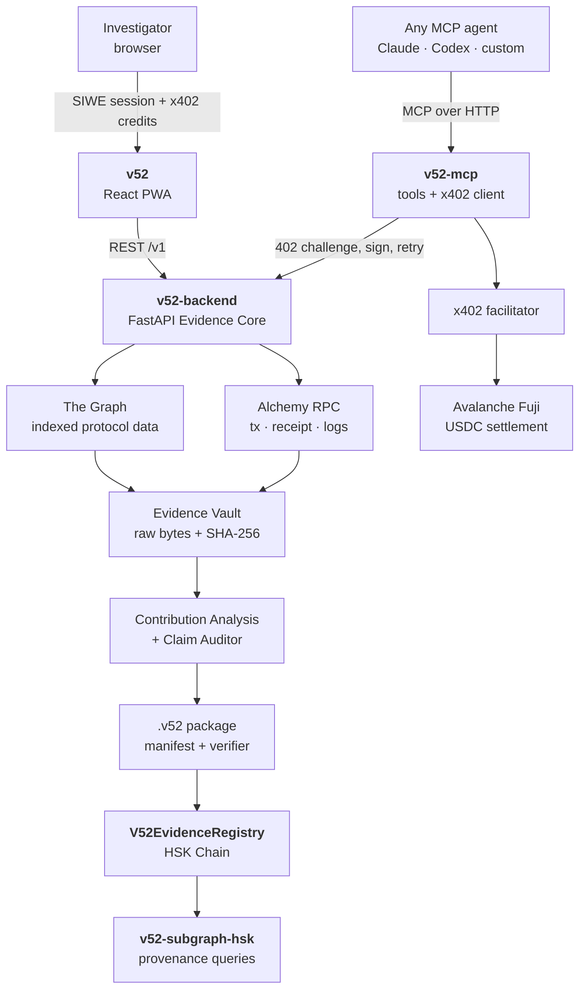

<div align="center">

# VECTOR52

### Open forensic audit infrastructure for onchain claims — for humans and for AI agents

**Don't just trace the money. Prove the claim.**

<br/>

[](https://ethereum-bolivia-buildathon.devfolio.co/)
[](#sponsor-navigation)
[](#sponsor-navigation)
[](#sponsor-navigation)

[](https://v52-chain.vercel.app)
[](https://v52-backend.onrender.com)
[](https://v52-backend.onrender.com/docs)
[](https://v52-backend.onrender.com/healthz)


</div>

---

## The problem

Blockchain data is public. Conclusions drawn from it are not automatically correct.

- A wallet that touches a router moving millions is **not** responsible for that whole volume — but almost every dashboard presents it that way.
- Graphs draw an arrow between two addresses without ever saying **which event** supports it.
- Vendor labels get promoted to facts, and "connection" silently becomes "attribution".
- An AI agent can produce a convincing explanation while preserving **nothing**: not the query, not the block, not the raw response, not the methodology.
- Reports die inside the tool that generated them. Nobody outside can re-verify them.
- Independent researchers, universities and small teams cannot pay enterprise forensics pricing for a single investigation.

The result is a field where a confident narrative outranks reproducible evidence.

## The solution

Vector52 takes a transaction, a wallet or a **claim**, and answers a different question than a block explorer does: *is this conclusion actually supported by evidence?*

```
VALIDATE -> ACQUIRE (The Graph + Alchemy RPC) -> PRESERVE RAW + SHA-256
   -> NORMALIZE -> RECONCILE -> CONTRIBUTION ANALYSIS -> CLAIM AUDITOR
   -> EVIDENCE GAPS -> .v52 PACKAGE -> VERIFY -> HSK ANCHOR
```

Every result carries its epistemic class, never a bare assertion:

| Class | Meaning |
|---|---|
| `EVIDENCE` | Observable fact, preserved with its source |
| `CLAIM` | Statement submitted for evaluation |
| `HYPOTHESIS` | Possible explanation, not yet demonstrated |
| `ASSERTION` | Conclusion derived by a reproducible rule |
| `UNKNOWN` | Insufficient evidence, or the limit of observation |

And a claim can only end in one of five verdicts: `SUPPORTED`, `PARTIALLY_SUPPORTED`, `MISLEADING`, `REFUTED`, `UNKNOWN`.

> **The operating rule of the whole system**
>
> The Core computes. The evidence proves. The agent explains and requests. The person concludes.
>
> The LLM never computes an amount, never invents a label, and never issues a verdict.

## Architecture

Two access channels, one forensic core. A human signs in with their wallet; an AI agent pays per call with x402. Neither gets a different Core, and neither gets a secret route.



**Trust boundaries.** The frontend never holds an API key. MCP never mutates primary evidence. The Graph and Alchemy are providers, not consensus — disagreements are surfaced, not hidden. HSK receives hashes only: never wallets, claim text, verdicts or PII. An x402 payment authorizes a job; it never validates its conclusion.

## Repositories

| Repository | What it is | Stack |
|---|---|---|
| [**v52**](https://github.com/v52-Chain/v52) | Installable PWA: wallet map, audit form, evidence inspector, verdict panel, Agent Access hub | React · TypeScript · Vite · Reown AppKit |
| [**v52-backend**](https://github.com/v52-Chain/v52-backend) | Evidence Core: acquisition, SHA-256 preservation, Graph/RPC reconciliation, `.v52` packaging, verifier, HSK anchoring, dual access channels | Python 3.11 · FastAPI · web3.py |
| [**v52-onchain**](https://github.com/v52-Chain/v52-onchain) | `V52EvidenceRegistry` for HSK, deploy scripts, ABIs, x402 facilitator research | Solidity 0.8.26 · Foundry |
| [**v52-mcp**](https://github.com/v52-Chain/v52-mcp) | MCP server exposing the forensic tools to any agent, with a local spend policy and x402 payments | Node 22 · TypeScript · viem |
| [**v52-subgraph-hsk**](https://github.com/v52-Chain/v52-subgraph-hsk) | Subgraph indexing `CaseAnchored` / `CaseSuperseded` for public provenance | The Graph |

## What actually runs today

We do not mark a component green because a screenshot exists. Status here means another person can reproduce it.

| Component | Status | Evidence |
|---|---|---|
| Backend API deployed and public | `VERIFIED` | [`/healthz`](https://v52-backend.onrender.com/healthz) · [`/v1/providers/status`](https://v52-backend.onrender.com/v1/providers/status) · 125 tests |
| PWA deployed and installable | `VERIFIED` | [v52-chain.vercel.app](https://v52-chain.vercel.app) · 11 tests |
| Evidence acquisition + SHA-256 preservation | `VERIFIED` | Alchemy RPC reporting `UP` for Ethereum and Avalanche, The Graph `CONFIGURED`, endpoints redacted in the response |
| Graph/RPC reconciliation with typed states | `VERIFIED` | `CORROBORATED` · `MISMATCH` · `INDEXER_LAG_SUSPECTED` · `RPC_UNAVAILABLE` · `INSUFFICIENT_DATA` |
| x402 settlement on Avalanche Fuji | `VERIFIED` | Real settled transactions, checked against RPC receipts — see below |
| HSK evidence anchoring, end to end | `VERIFIED` | Contract live on HSK Testnet, anchored from the backend — see below |
| MCP server with paid and free tools | `VERIFIED` | `vector52_wallet_flow` pays a live 402 challenge end to end; `vector52_status` reads the Core without spending |
| `V52EvidenceRegistry` contract | `VERIFIED` | 43 Foundry tests, unit + fuzz |
| Contribution Analysis and Claim Auditor | `PARTIAL` | Deterministic MVP for direct flow; predicate engine and Uniswap V3 resolver are still stubs, so the public verdict returns `UNKNOWN` **by design** rather than guessing |
| Contract source verification on explorer | `BLOCKED` | HSK Testnet exposes no confirmed Etherscan-style verifier; byte-for-byte reproduction instructions published instead |
| `V52ServiceRegistry` on Avalanche | `PENDING` | Blocked until a facilitator actually settles EVM; the official plugin implements only `stellar` in `handleVerify`/`handleSettle` |
| HSK Mainnet (177) deployment | `PENDING` | Testnet used as declared contingency, not presented as Mainnet |
| HSK subgraph | `PENDING` | Documented scaffold only |

## Verifiable artifacts

**HSK Testnet — chain `133`**

| Item | Value |
|---|---|
| `V52EvidenceRegistry` | [`0x3422820Ef9FBC8e0206E4CBcB6369dBd14BE18c4`](https://testnet-explorer.hsk.xyz/address/0x3422820Ef9FBC8e0206E4CBcB6369dBd14BE18c4) |
| Deploy transaction | [`0xe1fa5722...80782`](https://testnet-explorer.hsk.xyz/tx/0xe1fa572227cb85f0c944e7038cc66a684b7d21489fa1ff9532c770f2ea480782) |
| Live anchor (smoke test) | [`0xd97a0054...225fb`](https://testnet-explorer.hsk.xyz/tx/0xd97a0054d252bccbb17cbb4e4f0fc84cbd23eba4bbfc84fc9c40ccf03a8225fb) |

**Avalanche Fuji — chain `43113`, x402 `exact` scheme, test USDC `0x5425890298aed601595a70AB815c96711a31Bc65`**

| Settlement | Paid from |
|---|---|
| [`0x3d3a286c...652db`](https://subnets-test.avax.network/c-chain/tx/0x3d3a286c5cc3fcde20a59448a5e050b5e6c646652daf500ad47be1c9047652db) | Python client against the backend, block `58338308` |
| [`0x187edecb...61de2`](https://subnets-test.avax.network/c-chain/tx/0x187edecb13dae081798a69a4a11a41d2fd1e5a42b61700104de89ebbe9061de2) | TypeScript client against the deployed Render backend, block `58339217` |

Each settlement was confirmed independently with `eth_getTransactionReceipt`: `status: 1`, a `Transfer` event on the test USDC contract for exactly the advertised atomic amount, and a matching balance delta on the payer wallet.

## Verify it yourself

```bash
# 1. The API is alive and reports provider state without leaking any key
curl https://v52-backend.onrender.com/healthz
curl https://v52-backend.onrender.com/v1/providers/status

# 2. The agent channel advertises its price before anyone pays anything
curl https://v52-backend.onrender.com/v1/agent/capabilities
# -> {"ready":true,"network":"eip155:43113","asset":"0x5425...Bc65",
#     "amount_atomic":"1000","amount_display":"0.001","billing_model":"PER_REQUEST"}

# 3. The paid channel really answers 402 before it answers data.
#    The payment-required header is base64 of the x402 challenge JSON.
curl -i -X POST https://v52-backend.onrender.com/v1/agent/investigations/wallet-flow \
  -H "content-type: application/json" \
  -d '{"target_address":"0xf92A1E3Fa1a163FEeB8c3753165410374fB08339","chain_id":1,"limit":5}'

# 4. The HSK anchor exists onchain. No backend, no key, no Foundry required.
curl -s -X POST https://testnet.hsk.xyz -H "content-type: application/json" -d '{
  "jsonrpc":"2.0","id":1,"method":"eth_call","params":[{
    "to":"0x3422820Ef9FBC8e0206E4CBcB6369dBd14BE18c4",
    "data":"0x4f0b58012407b6f2529df3afbb2ab609cb236ff00b8421c7a57f78128ee58ed6d54f5005"
  },"latest"]}'
# -> 0x...01  (isAnchored == true)

# Same check with Foundry, if you prefer a readable signature:
cast call 0x3422820Ef9FBC8e0206E4CBcB6369dBd14BE18c4 \
  "isAnchored(bytes32)(bool)" \
  0x2407b6f2529df3afbb2ab609cb236ff00b8421c7a57f78128ee58ed6d54f5005 \
  --rpc-url https://testnet.hsk.xyz
```

## Demo path

| Segment | What is shown |
|---|---|
| Problem | A neutral, falsifiable claim about attributed router volume |
| Acquisition | The Graph entities and Alchemy tx / receipt / logs, both preserved and hashed |
| Analysis | Protocol volume against subject-attributable value — two different numbers, never conflated |
| Honesty | Evidence gaps, warnings, `WHY THIS LINK?` per edge, `UNKNOWN` where evidence runs out |
| Portability | `.v52` export, integrity `PASS`, one altered byte, integrity `FAIL` |
| Provenance | Manifest root anchored on HSK, queried back from chain |
| Agent economy | An MCP agent hits `402`, validates network and asset locally, signs, settles on Avalanche, receives the report |

## Sponsor navigation

| If you are judging | Start here | Then review |
|---|---|---|
| **Avalanche** | [Live PWA](https://v52-chain.vercel.app) | [`v52-mcp`](https://github.com/v52-Chain/v52-mcp) payment policy and tools, [`v52-backend`](https://github.com/v52-Chain/v52-backend) `app/payments/x402.py`, settled Fuji transactions above |
| **HSK Chain** | [Live PWA](https://v52-chain.vercel.app) | [`v52-onchain`](https://github.com/v52-Chain/v52-onchain) contract and threat model, [`v52-backend`](https://github.com/v52-Chain/v52-backend) `app/onchain/`, anchor transactions above |
| **Road to ShanhaiWoo / EAG** | This page | Architecture, the dual access model, and the open-tooling roadmap below |

## Why this matters beyond the hackathon

Vector52 is built as open infrastructure, not a closed product. A small team, a university lab or an independent journalist can run the whole stack, bring their own AI agent, pay only for the expensive compute they actually request, and hand a third party a `.v52` file that re-verifies **without trusting us**.

That is the part we care about: an investigation whose authority comes from its evidence, not from the brand of the tool that produced it.

**Roadmap after the buildathon:** complete the predicate engine and Uniswap V3 resolver, ship the HSK subgraph, deploy `V52ServiceRegistry` once EVM settlement is real, publish `v52-spec` (the `.v52` format and schemas) and `v52-bench` (public fixtures and benchmarks).

## Team

Built in Bolivia by four people.

| Member | Ownership |
|---|---|
| **Omar** | PWA architecture, frontend, integration and demo |
| **Franco** | Backend and Evidence Core, Alchemy RPC, reconciliation, packaging, tests |
| **Saúl** | The Graph, contracts and deployments, x402 and relayer infrastructure, subgraph |
| **Jhamil** | Frontend co-development, Agent Access experience, MCP contract and states |

## Engineering standards we hold ourselves to

- Raw provider responses are hashed **before** any decoding or analysis.
- Token amounts travel as integer strings plus decimals. Never as floats.
- Provider degradation produces `DEGRADED` / `PARTIAL` / `UNKNOWN`, never a fabricated `COMPLETE`.
- API keys live only in the backend, and are redacted from errors, logs and exported packages.
- An onchain interaction never becomes a `CONTROLLED_BY` relationship.
- No mock is ever promoted to `READY`.

<div align="center">
<br/>

**Ethereum Bolivia Buildathon 2026**

<sub>Every network state, address, endpoint and status on this page is re-captured at submission time.</sub>

</div>
